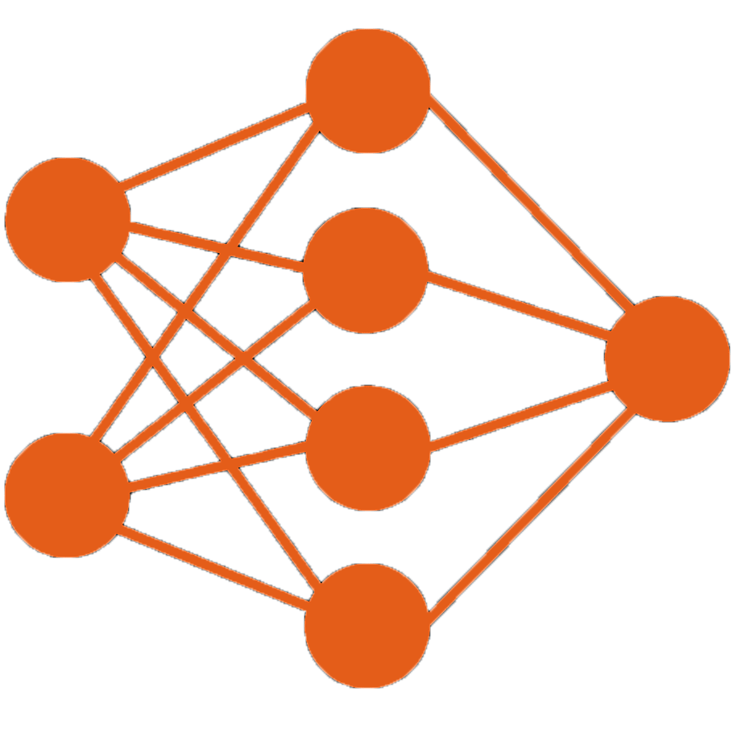

# The Deep Learning Anatomy 


A Comprehensive **Deep Learning** _Project Catalogue_ holding sophisticated details of a project implmented using both _Pytorch_
and _Keras_ 


```A Deep Neural Network```

***


## Project Abstract 

_A progressive web application which holds all the Deep Learning projects that I work on, during the timeline. Post every project's completion all the meta-data regarding the deep learning model unique to that particular problem statement is dynamically collected, organised and made into a report file to establish the parameters of the project for future reference and a better understanding of the project itself. This organised information is then rendered on the web application deployed on the cloud for anyone to briefly absorb the concept behind the implementation. The application will also include a section, to allow, the manual intervention of a user to try out the model in real-time with their input concerning the project._


## Deployment Log 

- _None_


## Change Log

- **[24th Jan, 2021]**  _init_

  - Developed a pipeline script which is executed post project development, this gathers all the meta information from the project such as The Neural Network     Architecture ( _layers_, _Hidden Units_ ), Type of Prediction ( _Classification_, _Regression_), Type of Network ( _Convolutional_, _Recurrent_ ) etc. The meta info is organised and a report file is created, which is then processed by the application from the project _dir_ to be rendered on the Web Page.
  - Partially developed Application codebase. Front-End Project Artefacts are laid down 
  
  
- **[26th Jan, 2021]** _new patches_ 
  - created variable_dict and prompt_dict
  - Added commandline functionalities to the pipeline script to handle var-dicts and prompt-list
  - now the prompts under the project artefacts are predefined and dynamically generated
  - segmented artefacts and plots into radios
  - added download-link to the source-code pdf
  

  
